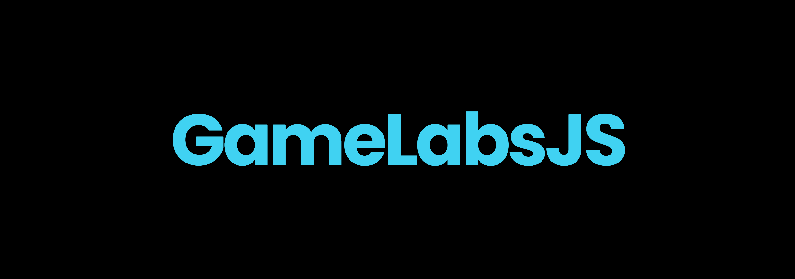

# 🎮 GameLabsJS - A Welcoming 2D Game Engine for JavaScript Enthusiasts 🌟

Welcome to GameLabsJS, an open-source JavaScript game engine designed to make your game development journey as smooth and enjoyable as possible! Our primary focus is on 2D games, and we are committed to delivering a powerful, easy-to-use toolset for creating amazing experiences.

(WIP) Please keep in mind that this README is a WIP and a lot of the links and instructions will not work!\

## 📙 Features

- **Easy Scene Setup:** Set up scenes with minimal effort using our intuitive API.
- **Drag & Drop Assets:** Import your assets effortlessly and integrate them into your game.
- **Asset Properties:** Assign properties to your assets and manipulate them with ease.
- **Custom Vector Class:** Utilize our built-in vector class for simplified game logic and physics.
- **Future-Proof:** Our engine is designed to grow, with plans for physics, advanced input handling, and more!

## 🎓 Getting Started

1. Clone this repository:
git clone https://github.com/SyncedTogether/GameLabJS
2. Install the prerequisite: Node.js
3. Run the example project:
node app.js (will be changed to npm start in future versions)

For a more detailed guide on how to use GameLabsJS, check out our [Getting Started](docs/getting-started.md) (WIP) guide and the [Wiki](https://github.com/SyncedTogether/GameLabJS/wiki) (WIP).

## 💖 Contributing

We believe that great things happen when a community comes together! Whether you're a developer, a designer, or just an enthusiast, your contribution is welcome and appreciated.

### 🤝 Contribution Protocol

1. Fork the repository.
2. Create a new branch with a descriptive name, such as `feature-my-awesome-feature` or `fix-this-annoying-bug`.
3. Commit your changes to the new branch. Be sure to write clear and concise commit messages.
4. Open a pull request with a detailed description of your changes. Include any relevant screenshots, gifs, or code snippets.
5. Wait for your pull request to be reviewed and approved by a maintainer. They may ask for additional changes or clarification.
6. Once approved, your changes will be merged into the main branch!

For more information, please read our [Contribution Guide](docs/contributing.md) and [Code of Conduct](docs/code-of-conduct.md).

## 🚀 Roadmap

Our journey has just begun, and we have so much more planned for GameLabsJS! Here's a sneak peek at some upcoming features:

- Physics Engine
- Advanced Input Handling
- Animation System
- UI and Menu System
- Asset Management

To see our full roadmap, check out our [Roadmap](docs/roadmap.md) (WIP) document.

## 📄 License

GameLabsJS is [MIT licensed](LICENSE).

## 💬 Community

Join our [Discord](https://discord.gg/MbVE9ujcFt) server to connect with other GameLabsJS enthusiasts, ask questions, share your creations, and stay updated on the latest news and updates!
